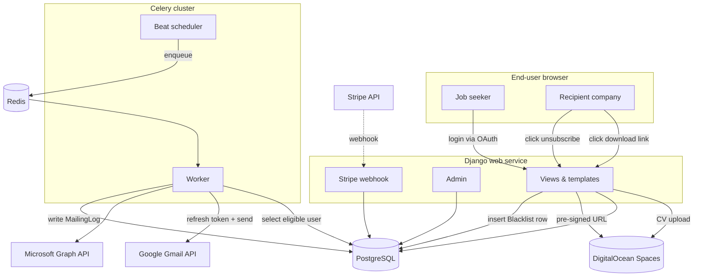
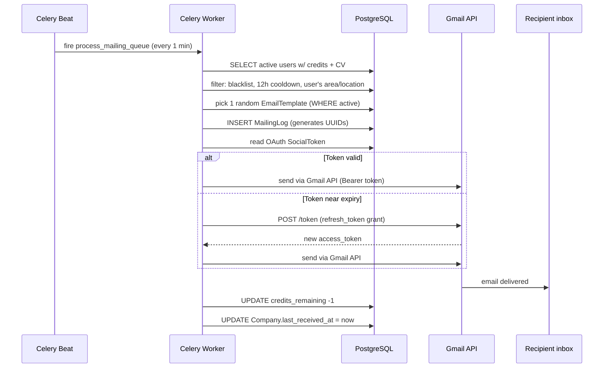
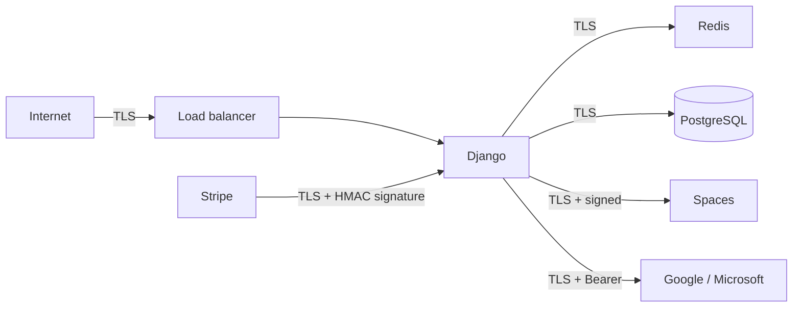

# Architecture Overview

This document describes the system as a whole: components, data flow, and the
interactions between them. For feature-level detail, see the individual docs
under [`features/`](features/).

---

## Why this shape (monolith + Celery + Redis)

A few design decisions upfront, because they explain the rest of the system:

1. **Monolith over microservices.** The whole product fits in one codebase. Splitting auth, mailing, and payments into separate services would quadruple the ops burden for zero correctness benefit at this scale.
2. **Celery over cron.** A cron-driven shell script would work for "send one email every 5 minutes," but it would get tangled when we need per-user rate limits, retries on transient failures, and dynamic pauses. Celery gives us those for free.
3. **OAuth send over our own SMTP.** The user's own Gmail/Outlook account is the email sender. That's the entire deliverability moat — we are **not** a new mail server that ISPs have to learn to trust.
4. **Link over attachment.** PDF attachments blow up spam scores. A UUID-scrambled download link attached to a specific `MailingLog` row is indistinguishable from a link in a personal email.

---

## System-level diagram

**Reading the diagram:** every solid arrow is a synchronous call; the dashed arrow is an async push from Stripe. The `Async` cluster (beat + worker + Redis) is the critical path for outbound email — if Celery is down, users' dashboards still work, nothing sends, and logs make that obvious.

---

## Apps and what they own

| App | Responsibility | Key files |
|---|---|---|
| `apps/accounts` | Custom `User` model (extends `AbstractUser`), signup bonus signal, allauth adapter. | `models.py`, `signals.py`, `adapters.py` |
| `apps/companies` | `Company` + `Blacklist` models, Excel importer, admin import view. | `models.py`, `importers.py`, `admin.py` |
| `apps/mailing` | Core. `EmailTemplate`, `MailingLog`, `SystemSettings` (singleton), Celery task, engine, rate-limit middleware, public views (CV download + unsubscribe). | `tasks.py`, `engine.py`, `views.py`, `middleware.py` |
| `apps/payments` | `CreditPackage`, `StripePayment`, Stripe Checkout + webhook handler. | `views.py`, `models.py` |
| `apps/dashboard` | User-facing dashboard — CV upload, filters, campaign toggle. Authenticated views only. | `views.py` |

---

## Data flow: the life of one CV send

See [`features/mailing-engine.md`](features/mailing-engine.md) for the code-level walk-through.

---

## Shared infrastructure

### Redis — two databases, not one

| DB | Used by |
|---|---|
| `redis://.../0` | Celery broker + result backend |
| `redis://.../1` | Django cache (used by rate limiting) |

**Why separate:** cache eviction policy (LRU) would occasionally drop pending Celery tasks if they shared a database. Two databases on one Redis instance costs nothing and eliminates that risk.

### PostgreSQL

All persistent state. OAuth tokens live here (encrypted at rest via your DB hosting provider's disk encryption). Losing the DB means every user has to re-authorize — hence the backup item in the P1 TODO list.

### DigitalOcean Spaces

User CV PDFs. Private bucket (`AWS_DEFAULT_ACL = "private"`). Each download request generates a **time-limited pre-signed URL** (5 minutes, configurable via `AWS_QUERYSTRING_EXPIRE`).

---

## Trust boundaries

- **Public endpoints** (`/cv/<uuid>/`, `/unsubscribe/<uuid>/`): rate-limited by IP, token is the only authentication.
- **User endpoints** (`/dashboard/*`): session cookie, CSRF protected.
- **Admin endpoints** (`/admin/*`): `is_staff=True` gate, additional CSRF, no public exposure recommended.
- **Webhook endpoint** (`/payments/webhook/`): signature-verified via `stripe.Webhook.construct_event`. No other auth.

---

## Concurrency model

- **Web process:** one Gunicorn worker handles one request at a time; multiple workers run in parallel (docker-compose runs 3 by default).
- **Celery worker:** concurrency 4 (also configurable). Each "slot" can process one task at a time. With 4 workers, up to 4 users can have their CV sent in the same tick — though the per-user slow-drip interval means a single user never exceeds 1 email / 5 minutes.
- **Celery beat:** always exactly 1 instance. Running two would fire every periodic task twice. The `docker-compose.yml` enforces this with a single `celery_beat` service.

---

## Failure modes and recovery

| Failure | Behavior |
|---|---|
| Redis unreachable | Cache backend has `IGNORE_EXCEPTIONS=True` → site stays up; rate limiting silently degrades (best-effort). Celery queue operations will block — address Redis before users notice. |
| PostgreSQL unreachable | Site 500s. No automatic failover. |
| Gmail/Graph 5xx | Task catches the exception, writes `MailingLog(status=FAILED, error_message=...)`, continues with next user on the next tick. No retry in the same tick (by design — we don't want to hammer a sender's reputation). |
| OAuth token expired and un-refreshable | Campaign paused, user notified via transactional email. See [`features/notifications.md`](features/notifications.md). |
| Stripe webhook replays | Idempotent: second call no-ops because `StripePayment.status` is already `COMPLETED`. |

---

## Where to go next

- [`features/mailing-engine.md`](features/mailing-engine.md) — if you care about the one thing that actually makes this product work.
- [`features/security.md`](features/security.md) — if you care about not getting breached.
- [`run.md`](run.md) — if you just want to run it locally.
