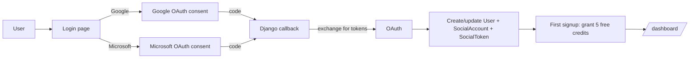

# Authentication

FastJob has **no passwords**. Every user authenticates via Google or Microsoft OAuth2. This isn't a convenience choice — the mailing engine needs delegated send access to the user's inbox, so OAuth is the only viable auth model.

---

## Overview

Login happens in one of two flows:



The first time a user signs in, we:
1. Create a `User` row (custom model extending `AbstractUser`).
2. Create a `SocialAccount` and `SocialToken` row (via django-allauth).
3. Fire `allauth.account.signals.user_signed_up` → grants 5 free credits.

On subsequent logins, only the `SocialToken` is updated (new access + refresh tokens).

---

## Tech specs

### Libraries

| Library | Version | Role |
|---|---|---|
| `django-allauth` | 0.63.6 | OAuth orchestration, consent flow, token storage |
| `PyJWT` | 2.9.0 | Required by allauth for Google ID token validation |
| `cryptography` | 43.0.3 | Required by PyJWT for RSA signature checks |

### Files

| File | Purpose |
|---|---|
| `apps/accounts/models.py` | Custom `User` model |
| `apps/accounts/adapters.py` | `SocialAccountAdapter` hook |
| `apps/accounts/signals.py` | Signup bonus (5 free credits) |
| `apps/accounts/apps.py` | Wires the signal via `ready()` |
| `templates/account/login.html` | Custom Spanish login page |
| `config/settings.py` | `SOCIALACCOUNT_PROVIDERS` dict |

### Custom User model

```python
class User(AbstractUser):
    email = models.EmailField(unique=True)
    credits_remaining = models.IntegerField(default=0)
    is_campaign_active = models.BooleanField(default=False)
    active_cv = models.ForeignKey("accounts.CV", ...)
    area_filters = models.ManyToManyField("companies.Area", ...)
    location_filters = models.ManyToManyField("companies.Location", ...)
    stripe_customer_id = models.CharField(...)
```

**Why `AbstractUser` and not `AbstractBaseUser`:** we still want Django's built-in groups/permissions/admin integration. `AbstractUser` gives that for free while still letting us add fields.

### OAuth provider config

```python
SOCIALACCOUNT_PROVIDERS = {
    "google": {
        "SCOPE": [
            "openid", "email", "profile",
            "https://www.googleapis.com/auth/gmail.send",
        ],
        "AUTH_PARAMS": {"access_type": "offline", "prompt": "consent"},
    },
    "microsoft": {
        "SCOPE": ["Mail.Send", "User.Read", "offline_access"],
        "AUTH_PARAMS": {"prompt": "consent"},
    },
}
```

**The scopes are deliberately minimal.** We ask for the least privilege that still lets us do the job:
- `gmail.send` — send email as the user. **Cannot** read the inbox.
- `Mail.Send` — equivalent on Microsoft side.
- `offline_access` — give us a refresh token so we're not re-prompting the user every hour.

### Token storage

Stored in `allauth.socialaccount.models.SocialToken`:
- `token` — the current access token (~1h TTL).
- `token_secret` — the refresh token (indefinite).
- `expires_at` — datetime for when the access token dies.

**Encryption at rest:** allauth does **not** encrypt these columns. Security depends on your DB hosting disk encryption. If you're paranoid, extend this with a [django-cryptography](https://django-cryptography.readthedocs.io) `EncryptedCharField`. See [`security.md`](security.md) for the full threat model.

---

## User perspective

### First-time signup

1. User lands on the homepage.
2. Clicks "Empezar con Google" (or Microsoft).
3. Redirected to Google / Microsoft consent screen.
4. Sees a request for:
   - Basic profile info (email, name)
   - **"Send email on your behalf"** permission
5. Clicks "Allow".
6. Redirected back to `/dashboard/` with 5 free credits.

### Returning user

1. Clicks "Iniciar sesión".
2. Same OAuth round-trip (usually silent if consent was persistent).
3. Lands on `/dashboard/`.

### What the user sees on the dashboard

A "Cuenta vinculada" card shows which provider is linked (Gmail or Outlook logo). This makes it obvious which account will be used to send email.

### What the user can do with their account

- **Re-authorize** by clicking "Cerrar sesión" and logging in again. This re-runs the consent flow and refreshes tokens.
- **Disconnect** by revoking access in their Google ([myaccount.google.com → Security → Third-party apps](https://myaccount.google.com/security)) or Microsoft ([account.microsoft.com → Privacy](https://account.microsoft.com)) settings. The next send attempt will fail and they'll get a re-link email.

---

## Admin perspective

### `Django Admin → Usuarios`

- Lists all users with `email`, `credits_remaining`, `is_campaign_active`, and `Proveedor OAuth` (Google / Microsoft / —).
- Read-only on OAuth-related fields; you cannot edit someone's token from here (that would be a security hole).
- Can manually adjust `credits_remaining` for support cases.

### `Django Admin → Social Accounts` (allauth's built-in admin)

- See the raw `SocialAccount` ↔ `User` links.
- See `SocialToken` rows with `expires_at`.
- Rarely needed; useful when debugging a stuck account.

### What the admin cannot do

- See an OAuth access token's plain value in the list view (allauth masks it).
- Force a user to reconnect — that must come from the user themselves.

---

## Auto-pause on OAuth unlink

```python
# apps/accounts/signals.py
from allauth.socialaccount.signals import social_account_removed

@receiver(social_account_removed)
def pause_campaign_on_unlink(sender, request, socialaccount, **kwargs):
    user = socialaccount.user
    if user.is_campaign_active:
        user.is_campaign_active = False
        user.save(update_fields=["is_campaign_active"])
```

If a user disconnects their Google or Microsoft account (via `/accounts/social/connections/` or a provider-side revocation that allauth catches), we can no longer send on their behalf. Auto-pausing prevents the engine from churning through `FAILED` `MailingLog` rows on every tick.

**Re-linking:** the user signs in again with the same provider — allauth creates a new `SocialAccount` and `SocialToken`. The user must manually toggle the campaign back on from the dashboard, matching the behavior of the [re-link notification flow](notifications.md).

---

## Signup bonus via signal

```python
# apps/accounts/signals.py
from allauth.account.signals import user_signed_up
from django.dispatch import receiver

SIGNUP_BONUS_CREDITS = 5

@receiver(user_signed_up)
def grant_signup_bonus(sender, request, user, **kwargs):
    if user.credits_remaining == 0:
        user.credits_remaining = SIGNUP_BONUS_CREDITS
        user.save(update_fields=["credits_remaining"])
```

**Why the `if user.credits_remaining == 0` guard:** defensive. `user_signed_up` fires exactly once per signup, but if the signal is ever accidentally double-connected (e.g. during a test reload), this prevents double-granting.

**Why a signal and not the allauth adapter's `save_user`:** `user_signed_up` fires **only on genuine signup**, not on every social login. The adapter's `save_user` fires on every login, which would re-grant credits every time someone logged in.

---

## Configuration

### Google OAuth app setup

1. Google Cloud Console → APIs & Services → Library → enable **Gmail API**.
2. OAuth consent screen → External → **add scope** `https://www.googleapis.com/auth/gmail.send`.
3. Credentials → Create → OAuth client ID → Web application.
4. Authorized redirect URI:
   - Local: `http://localhost:8000/accounts/google/login/callback/`
   - Prod: `https://<your-domain>/accounts/google/login/callback/`
5. Add the credentials to the `SocialApp` model via Django Admin.

### Microsoft OAuth app setup

1. Azure Portal → App registrations → New registration.
2. Redirect URI (Web): `http://localhost:8000/accounts/microsoft/login/callback/`
3. API permissions → Microsoft Graph → Delegated:
   - `Mail.Send`
   - `User.Read`
   - `offline_access`
4. Certificates & secrets → New client secret → **copy the value immediately** (it's shown once).
5. Add the client ID + secret via Django Admin -> Social Applications.

### Env vars (summary)

(OAuth credentials are now managed via Django Admin's `SocialApp` model.)

---

## Edge cases

| Scenario | Behavior |
|---|---|
| User signs in with Google, then Microsoft on the same email | Two `SocialAccount` rows, same `User`. The engine picks whichever is first via `socialaccount_set.first()`. Might want "primary provider" logic for P2. |
| User's Google account is suspended | Refresh token becomes invalid. Next send attempt raises `TokenExpiredError` → campaign pauses → re-link email. |
| User logs in but denies the `gmail.send` scope | Login succeeds (allauth doesn't fail on missing optional scopes). Sends will fail with a Gmail 403. P2: detect scope absence at login time and show a warning. |
| Admin tries to create a user in `/admin/` directly | Works (they get a username+password login), but the user will never have a `SocialAccount` and can't send. Useful only for staff/support accounts. |

---

## Testing

Auth flows are **not** unit-tested end-to-end (would require mocking Google's server response — overkill). Instead:
- The engine tests (`test_engine.py`) use fixtures that pre-create `SocialAccount` + `SocialToken`, which simulates the post-login state.
- Manual QA: a staging environment with real test OAuth apps.

---

## Related docs

- [`mailing-engine.md`](mailing-engine.md) — how the stored tokens are actually used to send email.
- [`notifications.md`](notifications.md) — what happens when tokens expire.
- [`security.md`](security.md) — token-storage threat model.
- [`user-dashboard.md`](user-dashboard.md) — what the user sees after login.
 stored tokens are actually used to send email.
- [`notifications.md`](notifications.md) — what happens when tokens expire.
- [`security.md`](security.md) — token-storage threat model.
- [`user-dashboard.md`](user-dashboard.md) — what the user sees after login.
