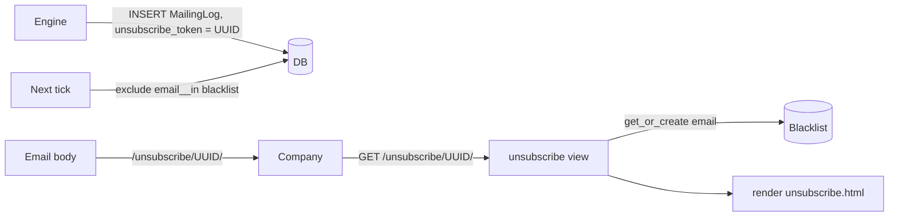

# Blacklist & Unsubscribe

Every outbound email includes a one-click unsubscribe link. Clicking it inserts the company's email into the `Blacklist` table. The engine permanently excludes blacklisted emails from future sends — for all users, not just the user who sent the email.

---

## Overview



The blacklist is **global** — if Company X unsubscribes from User A's email, User B also won't mail Company X. This prevents a company from being bombarded by multiple ResumeLink users after opting out.

---

## Tech specs

### Files

| File | Purpose |
|---|---|
| `apps/companies/models.py` | `Blacklist` model |
| `apps/mailing/views.py` | `unsubscribe()` view |
| `apps/mailing/urls.py` | URL pattern `/unsubscribe/<uuid:token>/` |
| `apps/mailing/tasks.py` | Pre-loads blacklist set for the tick |
| `templates/mailing/unsubscribe.html` | Confirmation page |

### Blacklist model

| Field | Type | Notes |
|---|---|---|
| `email` | `EmailField(unique=True)` | Unique — second unsubscribe is a no-op |
| `added_at` | `DateTimeField` | Defaults to `timezone.now()` |
| `reason` | `CharField(max_length=100)` | Default `"unsubscribe"`; admin can use other values (e.g. `"manual"`) |

The `unique=True` constraint on `email` makes `get_or_create` inherently idempotent — clicking unsubscribe twice inserts exactly one row.

### Unsubscribe view (`apps/mailing/views.py:57`)

```python
@ratelimit(key="ip", rate="10/h", block=True)
def unsubscribe(request, token):
    log = get_object_or_404(MailingLog, unsubscribe_token=token)
    email = log.company_email_snapshot or (log.company.email if log.company else None)
    Blacklist.objects.get_or_create(email=email, defaults={...})
    return render(request, "mailing/unsubscribe.html", {"email": email})
```

**Why the snapshot fallback:** if the `Company` row was deleted after the email was sent, `log.company` is `NULL`. `company_email_snapshot` captures the email at send-time so unsubscribe still works.

**Rate limit:** 10 requests/hour/IP. Prevents abuse of the endpoint as a "probe" to verify email addresses.

### How the engine excludes blacklisted companies

At the start of each tick, the task builds a Python `set` of all blacklisted emails in a single query:

```python
blacklisted_emails = set(Blacklist.objects.values_list("email", flat=True))
```

Then for each user, companies are filtered in-DB:

```python
companies = Company.objects.exclude(email__in=blacklisted_emails)
```

**Why load into memory:** the blacklist set is reused for every user in the same tick, so one DB round-trip serves all users. At scale (thousands of blacklist entries) this should be replaced with a subquery or JOIN.

---

## Admin perspective

### `Django Admin → Empresas → Lista Negra`

- **List:** email, reason, `added_at`.
- **Search:** by email.
- **Filter:** by reason.
- **Manual add:** admins can directly insert a `Blacklist` row for a company that requested manual removal outside the unsubscribe flow.
- **Delete:** removing a row un-blacklists the email. It can receive CVs again on the next engine tick.

**Caution:** un-blacklisting should only happen if you have explicit confirmation from the company that they want to receive CVs again. Otherwise you're re-adding them against their stated preference (a compliance risk).

---

## User perspective

### From the company's side

1. Company receives a CV email.
2. Clicks the unsubscribe link in the footer.
3. Sees a simple confirmation page: "Has sido dado de baja. No recibirás más correos."
4. Never receives another email from any ResumeLink user.

### From the job-seeker's side

Users don't see the blacklist. They simply notice that a company they previously mailed never appears in their activity feed again — the engine silently skips it. This is intentional: there's no UI value in surfacing "Company X said don't email them."

---

## Configuration

No env vars. The endpoint is public (no auth required — it must work for the company recipient who has no ResumeLink account).

---

## Edge cases

| Scenario | Behavior |
|---|---|
| Company clicks unsubscribe twice (e.g. double-click) | `get_or_create` returns the existing row. No duplicate, no error. |
| `MailingLog` row deleted before company clicks unsubscribe | `get_object_or_404` returns 404. Company sees an error page. The link is functionally dead. |
| Company email changed in `Company` admin after unsubscribe | Blacklist entry uses the old email. The new email is not blacklisted. Admin should manually add the new email if needed. |
| Blacklist table grows large | Loading the whole table into memory at every tick becomes costly. P2 mitigation: use a DB-level `NOT IN (SELECT ...)` subquery instead. |
| Admin-inserted `reason = "manual"` | Engine treats it identically to `"unsubscribe"` — both are excluded. The `reason` field is purely informational. |

---

## Related docs

- [`mailing-engine.md`](mailing-engine.md) — how the blacklist is loaded and applied each tick.
- [`companies.md`](companies.md) — the `Company` model this feature references.
- [`security.md`](security.md) — rate limiting applied to this endpoint.
