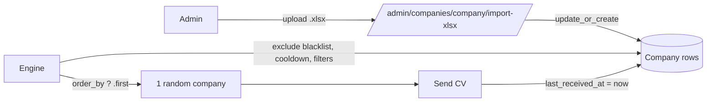

# Companies Database

The `Company` model is the address book for outbound CVs. It contains the set of companies FastJob can mail, plus metadata (area, location) that users can filter by. Companies are loaded in bulk by admin staff via an Excel importer.

---

## Overview



---

## Tech specs

### Files

| File | Purpose |
|---|---|
| `apps/companies/models.py` | `Company` + `Blacklist` models |
| `apps/companies/importers.py` | `import_companies_from_xlsx()` |
| `apps/companies/admin.py` | Admin list + custom import view |
| `templates/admin/companies/company/change_list.html` | "Import" button in admin list |
| `templates/admin/companies/import_xlsx.html` | Upload form |

### Company model

| Field | Type | Purpose |
|---|---|---|
| `email` | `EmailField(unique=True)` | Primary identifier; used for sending and blacklist matching |
| `name` | `CharField(max_length=300)` | Shown in email templates as `{company_name}` |
| `area` | `CharField(blank=True)` | Industry / sector (e.g. `"tecnología"`) |
| `location` | `CharField(blank=True)` | City / region (e.g. `"Madrid"`) |
| `last_received_at` | `DateTimeField(null=True)` | Timestamp of last successful send; drives the cooldown window |
| `created_at` | `DateTimeField(auto_now_add=True)` | Import timestamp |

**Why `email` is the unique key:** companies can rename themselves (M&A, rebrand), but their recruitment inbox is stable. Using email as the natural key means re-importing an updated spreadsheet always updates rather than duplicates.

### Excel importer

`import_companies_from_xlsx(file_obj)` in `apps/companies/importers.py`:

- Opens the workbook in read-only mode (efficient for large files).
- Expects the **first row** to be headers (case-insensitive).
- Required columns: `email`, `name`.
- Optional columns: `area`, `location` (empty string if absent).
- Uses `Company.objects.update_or_create(email=...)` — idempotent re-imports.
- Returns `(created, updated, errors)` counts.

**Column format example:**

| name | email | area | location |
|---|---|---|---|
| Acme Corp | jobs@acme.com | tecnología | Madrid |
| Widgets SL | hr@widgets.es | manufactura | Barcelona |

**Validation rules:**
- Empty file → single error returned.
- Missing required column → single error, import aborted.
- Row with invalid email or empty name → per-row error, row skipped, rest of import continues.

---

## Admin perspective

### `Django Admin → Empresas → Empresas`

- **List:** name, email, area, location, `last_received_at`, `created_at`.
- **Search:** by name, email, area, location.
- **Filters:** by area, location.
- **Import button:** top-right "Importar Excel" button → `/admin/companies/company/import-xlsx/`.
- **Import flow:**
  1. Click "Importar Excel".
  2. Pick an `.xlsx` file.
  3. Click "Importar".
  4. Success banner shows `N creadas, M actualizadas`. Warnings show per-row errors (capped at 10 displayed).

### Editing a company

Admins can edit `name`, `area`, `location` inline. **Do not change `email`** after a company has `MailingLog` rows — the `company_email_snapshot` in those logs captures the address at send-time, so audit history remains correct, but changing the email means future sends go to the new address.

### Resetting `last_received_at`

Clearing `last_received_at` on a company row makes it immediately eligible for the next send (bypasses the cooldown). Useful to force a re-send in testing, or after a support request from a company that missed an email.

---

## User perspective

Users don't browse the company list directly. They configure **area** and **location** filters on their dashboard. The engine applies these filters as `icontains` matches against `Company.area` and `Company.location`:

```python
if user.area_filter:
    companies = companies.filter(area__icontains=user.area_filter)
if user.location_filter:
    companies = companies.filter(location__icontains=user.location_filter)
```

**Practical implication:** if a user sets `area_filter = "tecnología"`, only companies with `"tecnología"` anywhere in their `area` field are eligible. The match is case-insensitive, so `"Tecnología"`, `"tecnología digital"` all match.

If the filters are empty, the engine considers the entire non-blacklisted, non-cooled-down company pool.

---

## Configuration

No env vars specific to this feature. The importer uses `openpyxl` (pinned in `requirements.txt`).

---

## Edge cases

| Scenario | Behavior |
|---|---|
| Re-import same file twice | Second import updates 0, creates 0; idempotent. |
| Email with uppercase letters in xlsx | Normalized to lowercase via `email.lower()` before upsert. |
| Company row deleted while in a `MailingLog` FK | `MailingLog.company` → `NULL` (`on_delete=SET_NULL`). `company_email_snapshot` preserves the address. |
| All companies match user's filters but all are in cooldown | No send that tick; retried next tick. |
| Area/location filter typo (e.g. "tecnolgia") | No match → no sends. User must fix via dashboard. Engine doesn't warn user — they just see no activity. |

---

## Testing

- `apps/companies/tests/test_importers.py` — covers missing columns, invalid emails, partial errors, happy-path upsert.

---

## Related docs

- [`mailing-engine.md`](mailing-engine.md) — how the company pool is queried per send.
- [`blacklist-unsubscribe.md`](blacklist-unsubscribe.md) — how companies opt out.
- [`user-dashboard.md`](user-dashboard.md) — area/location filter UI.
