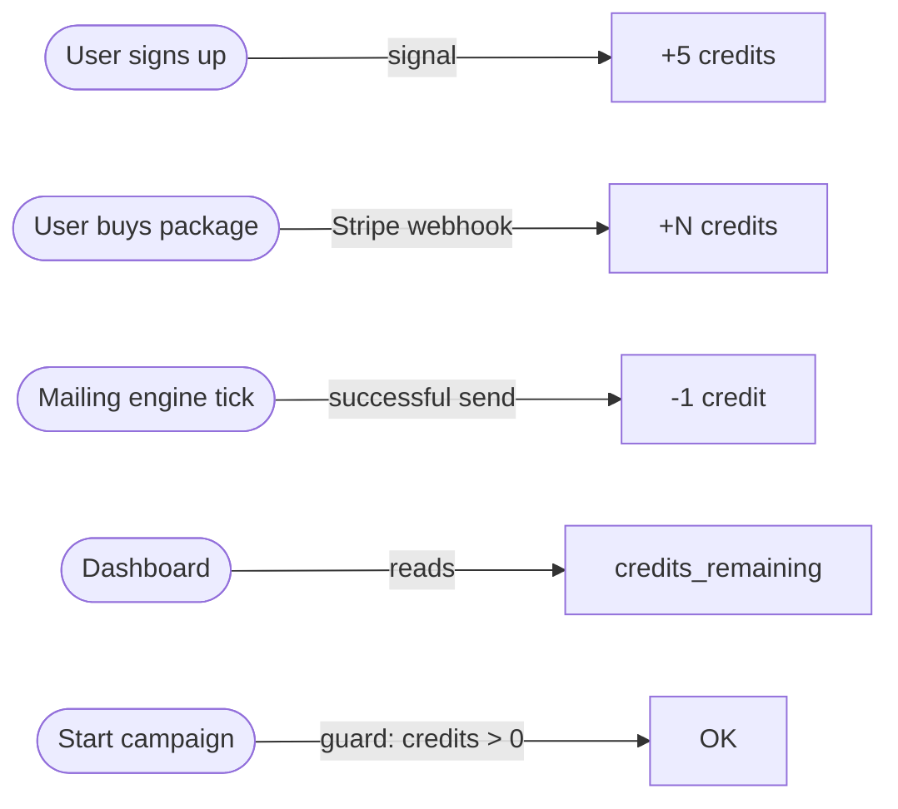

# Credits System

Credits are the consumption unit: 1 email sent = 1 credit deducted. Users start with 5 free credits at signup and can buy more via Stripe. Credits never expire.

---

## Overview



---

## Tech specs

### Where credits live

Credits are stored as a single integer on the `User` model:

```python
# apps/accounts/models.py
class User(AbstractUser):
    credits_remaining = models.IntegerField(default=0)
    ...
```

**Why on the User and not a separate ledger table:** the product doesn't need a full transaction history on the credits side — `MailingLog` already provides the send audit trail, and `StripePayment` provides the purchase history. A single integer keeps the engine query simple: `credits_remaining__gt=0`.

### Signup bonus

```python
# apps/accounts/signals.py
SIGNUP_BONUS_CREDITS = 5

@receiver(user_signed_up)
def grant_signup_bonus(sender, request, user, **kwargs):
    if user.credits_remaining == 0:
        user.credits_remaining = SIGNUP_BONUS_CREDITS
        user.save(update_fields=["credits_remaining"])
```

The bonus fires on `allauth`'s `user_signed_up` signal — exactly once, on genuine first signup. The `if credits_remaining == 0` guard is defensive: prevents double-grant if the signal is accidentally double-registered (e.g. test reloads).

### Credit deduction (engine)

In `apps/mailing/tasks.py`, after a successful send:

```python
user.credits_remaining -= 1
user.save(update_fields=["credits_remaining"])
```

Credit is only deducted on success. If Gmail or Graph returns a 5xx error, no credit is lost.

### Credit addition (payments)

In `apps/payments/views.py`, on Stripe `checkout.session.completed` webhook:

```python
user.credits_remaining += payment.credits_granted
user.save(update_fields=["credits_remaining"])
```

`credits_granted` is snapshotted from the `CreditPackage` at checkout creation, so a package price/credit change after purchase doesn't retroactively affect the user.

### Campaign start guard

In `apps/dashboard/views.py`, the `toggle_campaign` view blocks starting a campaign with zero credits:

```python
elif user.credits_remaining <= 0:
    messages.error(request, "No tienes créditos disponibles. Compra un paquete para continuar.")
```

The engine also independently checks `credits_remaining__gt=0` in its DB query, so even if the dashboard guard is bypassed, no send happens.

---

## User perspective

### Credit balance

Shown prominently on the dashboard as a count (e.g. "47 créditos"). No expiry date shown because credits don't expire.

### Running out of credits

1. Campaign auto-continues until credits hit 0 — the engine simply stops picking that user.
2. The campaign toggle remains "active" (it's not auto-paused on zero credits, unlike token expiry).
3. User sees no activity in the feed. They'll notice the balance is 0 and head to the packages page.

**Why not auto-pause:** auto-pausing on zero credits would require an extra check on every engine tick. The user's intent (campaign active) is preserved — as soon as they buy more credits, sends resume automatically without them having to re-enable the campaign.

---

## Admin perspective

### `Django Admin → Usuarios → <user>`

`credits_remaining` is editable directly. Admins can manually adjust credits for:
- Compensating a failed send batch.
- Granting promotional credits.
- Support cases.

There's no audit trail for manual adjustments — if that becomes important, it's a P2 item.

---

## Default packages (seeded)

| Package | Price | Credits | Per-credit cost |
|---|---|---|---|
| Starter | €9.99 | 50 | €0.20 |
| Pro | €29.99 | 200 | €0.15 |
| Elite | €69.99 | 600 | €0.117 |

These are seeded by `apps/payments/migrations/0002_seed_packages.py` and are fully admin-editable.

---

## Edge cases

| Scenario | Behavior |
|---|---|
| User buys two packages quickly before first webhook fires | Each webhook call is idempotent (`StripePayment.status` check). Both add credits independently. No race — each `StripePayment` is a separate row with a separate `credits_granted`. |
| Credits go negative (manual admin edit) | Engine skips the user (`credits_remaining__gt=0`). Campaign remains "active" but effectively paused until an admin corrects the balance. |
| User has credits but no CV or no linked OAuth | Engine skips them silently. Credits are not consumed. |

---

## Related docs

- [`payments.md`](payments.md) — how credits are purchased via Stripe.
- [`authentication.md`](authentication.md) — the signup signal that grants the bonus.
- [`mailing-engine.md`](mailing-engine.md) — where credits are deducted.
- [`user-dashboard.md`](user-dashboard.md) — how credits are displayed.
