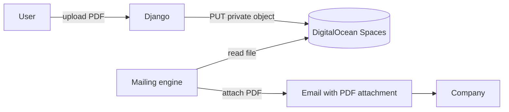

# CV Management

Each user can store **multiple CVs** and choose which one is "active." The active CV is the one the mailing engine sends. Every email snapshots the CV in use at send-time, so changing the active CV later doesn't retroactively affect emails already in recipients' inboxes. All PDFs live in private DigitalOcean Spaces storage and are fetched by the mailing engine to be sent as direct attachments.

---

## Overview



**Why this approach:**

1. **User Expectation.** Generic job application emails with attachments are standard professional practice. Recruiter workflows often involve immediate preview or bulk-downloading attachments from their inbox.
2. **Account Reputation.** By sending from the user's own Gmail/Outlook account, the email carries high inherent trust. Generic spam filters that often flag third-party links are bypassed because the attachment is part of a "human" interaction.
3. **Private storage.** The PDF itself is never publicly reachable. Only the Django server has IAM credentials to fetch the file from Spaces before attaching it to the outbound OAuth-signed email.

---

## Tech specs

### Files

| File | Purpose |
|---|---|
| `apps/accounts/models.py` | `CV` model + `User.active_cv` FK |
| `apps/dashboard/views.py` | `upload_cv`, `set_active_cv`, `delete_cv` views |
| `apps/mailing/views.py` | `cv_download` view (generates pre-signed URL) |
| `apps/mailing/models.py` | `MailingLog.cv` FK — snapshot at send-time |
| `config/settings.py` | `AWS_*` storage config |

### Data model

```python
class CV(models.Model):
    user = models.ForeignKey(User, on_delete=models.CASCADE, related_name="cvs")
    file = models.FileField(upload_to="cvs/")
    name = models.CharField(max_length=200, blank=True)
    created_at = models.DateTimeField(auto_now_add=True)

    def delete(self, *args, **kwargs):
        if self.file:
            self.file.delete(save=False)  # remove from Spaces
        super().delete(*args, **kwargs)


class User(AbstractUser):
    active_cv = models.ForeignKey("accounts.CV", on_delete=models.SET_NULL, null=True, blank=True, related_name="+")
    # ...


class MailingLog(models.Model):
    cv = models.ForeignKey("accounts.CV", on_delete=models.SET_NULL, null=True, blank=True, related_name="mailing_logs")
    # ...
```

**Why `MailingLog.cv` is `SET_NULL`:** a user deleting an old CV should not break past mailing logs. The log stays readable; the download endpoint simply 404s for that token.

### Storage

- **Backend:** `storages.backends.s3boto3.S3Boto3Storage` (from `django-storages`).
- **Bucket ACL:** `private` (never public).
- **Signing:** `AWS_QUERYSTRING_AUTH = True` and `AWS_QUERYSTRING_EXPIRE = 300` (5 minutes).
- **Signature version:** `s3v4` (required by DigitalOcean Spaces).

### Upload endpoint

`POST /dashboard/subir-cv/`

Accepts `multipart/form-data` with `cv_file` (the PDF) and optional `name` (user-facing label). Validations:
- Must end in `.pdf` (case-insensitive).
- Must be ≤ 10 MB.
- Creates a **new** `CV` row; never overwrites. The new CV becomes the active one; the old CV is preserved (user can delete it manually).

```python
# apps/dashboard/views.py — abridged
cv = CV.objects.create(user=user, file=cv_file, name=label)
user.active_cv = cv
user.save(update_fields=["active_cv"])
```

**Why we don't delete the old CV on upload:** the old flow deleted first and then saved the new file — if the new upload failed, the user ended up with no CV. The new flow is inherently atomic: the new CV either exists or it doesn't, and the old one is still there if anything goes wrong.

### Switching / deleting CVs

- `POST /dashboard/cv/<id>/activar/` — set that CV as `user.active_cv`.
- `POST /dashboard/cv/<id>/eliminar/` — delete the CV (file + row). If it was the active one, fall back to the most recent remaining CV; if there are none, auto-pause the campaign.

### Legacy Download endpoint (Optional)

`GET /cv/<uuid:token>/`

While the engine now defaults to attachments, the `/cv/` endpoint still exists for legacy tracking or optional link-based variants. It redirects to a time-limited pre-signed URL from S3/Spaces.

---

## Security model

| Concern | Mitigation |
|---|---|
| Large File Handling | Celery workers fetch the PDF from Spaces into memory/temp file before sending. The 10 MB limit prevents memory exhaustion. |
| IAM leak | Credentials are env vars; Spaces key should be scoped to a single bucket, not account-wide. See `deploy.md`. |
| Attachment Sensitivity | CVs are sent directly to the recipient. No public URLs are generated or shared in the default flow. |

See [`security.md`](security.md) for the full threat model.

---

## User perspective

### Uploading a CV

1. Dashboard → card labeled **"Tu CV"**.
2. File picker (native browser picker, styled with Tailwind).
3. Click "Subir CV" → upload happens in foreground, messages framework shows success.
4. The card now shows ✓ **"CV subido"** with the `cv_updated_at` date.
5. Replacing is the same flow — the button text changes to "Reemplazar CV".

### Constraints visible to the user

- "Solo PDF. Máximo 10 MB." (sub-text under the upload button).
- If they try to upload a `.docx`, they see an error message in Spanish.

### What the user doesn't see

- The actual bucket location, the UUID tokens, the pre-signed URL mechanism.
- How many times each CV has been downloaded (could be a P2 analytics feature).

---

## Admin perspective

### `Django Admin → Usuarios → <user>`

Under the "FastJob" fieldset:
- `cv_file` — clickable link to the (raw, authenticated) S3 path.
- `cv_updated_at` — timestamp.

Admins can delete a user's CV by clearing the field, but **they cannot preview it inside the admin UI** (would require proxying PDF streams, which we don't do).

### No separate "CV management" admin page

Everything is on the User page. If there's ever a support case where the admin needs to impersonate the user to verify the CV, they can reset the user's `cv_file` and ask the user to re-upload.

---

## Configuration

### Env vars

| Variable | Purpose |
|---|---|
| `AWS_ACCESS_KEY_ID` | Spaces access key |
| `AWS_SECRET_ACCESS_KEY` | Spaces secret |
| `AWS_STORAGE_BUCKET_NAME` | Bucket name (e.g. `fastjob-cvs`) |
| `AWS_S3_REGION_NAME` | `nyc3`, `ams3`, etc. |
| `AWS_S3_ENDPOINT_URL` | `https://<region>.digitaloceanspaces.com` |
| `AWS_S3_CUSTOM_DOMAIN` | Optional CDN domain |

### Knobs in `settings.py`

| Setting | Default | Impact |
|---|---|---|
| `AWS_DEFAULT_ACL` | `private` | **Never change to `public-read`.** |
| `AWS_S3_FILE_OVERWRITE` | `False` | Prevents name collisions when two users upload `cv.pdf`. |
| `AWS_QUERYSTRING_AUTH` | `True` | Forces pre-signed URLs. |
| `AWS_QUERYSTRING_EXPIRE` | `300` | Pre-signed URL TTL in seconds. Shorter = safer but risks slow clients timing out. |

### Bucket structure

```
<bucket>/
└── cvs/
    ├── <random-filename-1>.pdf
    ├── <random-filename-2>.pdf
    └── ...
```

Django-storages auto-generates unique filenames; the user's own name is never in the S3 key.

---

## Edge cases

| Scenario | Behavior |
|---|---|
| User uploads a very large (100 MB) file | Rejected server-side; browser also typically aborts at `MAX_UPLOAD_SIZE`. |
| User uploads a `.pdf` that's actually an image | Accepted (we don't parse content). Recipient will see a broken PDF — user's problem. |
| User deletes their account | `User.cv_file.delete()` must be called in the deletion path (P2 item — GDPR deletion flow). |
| Spaces is unreachable during download | `cv_download` renders `mailing/cv_not_found.html` with HTTP 500. |
| Pre-signed URL expires mid-download | Typically harmless — the TCP stream was already established before the expiry check. S3 returns 403 only for **new** requests after expiry. |
| User has no CV but engine somehow triggered a send | Engine guards with `cv_file__isnull=False` in the query — impossible. Defensive check in view returns 404. |

---

## Testing

See `apps/mailing/tests/test_views.py`:
- `test_cv_download_returns_404_for_unknown_token`
- `test_cv_download_shows_error_when_user_has_no_cv`
- `test_cv_download_redirects_to_signed_url` (mocks `boto3.client`)
- `test_rate_limit_returns_429`

---

## Related docs

- [`mailing-engine.md`](mailing-engine.md) — how `cv_download_token` is generated.
- [`security.md`](security.md) — rate limiting on this endpoint.
- [`user-dashboard.md`](user-dashboard.md) — the upload UX.
