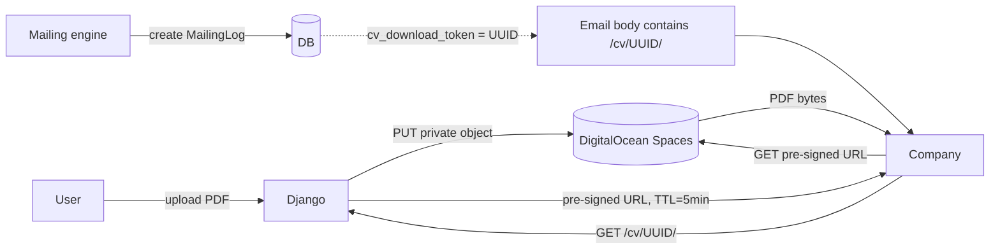

# CV Management

Each user can store **multiple CVs** and choose which one is "active." The active CV is the one the mailing engine sends. Every email snapshots the CV in use at send-time, so changing the active CV later doesn't retroactively affect emails already in recipients' inboxes. All PDFs live in private DigitalOcean Spaces storage and are served via UUID-scoped, time-limited download links.

---

## Overview



**Why this indirection:** three distinct problems are solved by the layers.

1. **Deliverability.** PDF attachments score high on spam filters and often trigger antivirus scans that delay or quarantine the email. A link in an email body looks identical to a link in a personal recommendation email.
2. **Per-send tracking.** If the link were `/cv/<user_id>/`, one leaked URL would expose every email that user has ever sent. With `/cv/<uuid>/`, a leaked URL only affects one send.
3. **Private storage.** The PDF itself is never publicly reachable. Only the Django server has IAM credentials, and it only hands out **time-limited** URLs (5 minutes by default).

---

## Tech specs

### Files

| File | Purpose |
|---|---|
| `apps/accounts/models.py` | `CV` model + `User.active_cv` FK |
| `apps/dashboard/views.py` | `upload_cv`, `set_active_cv`, `delete_cv` views |
| `apps/mailing/views.py` | `cv_download` view (generates pre-signed URL) |
| `apps/mailing/models.py` | `MailingLog.cv` FK — snapshot at send-time |
| `config/settings.py` | `AWS_*` storage config |

### Data model

```python
class CV(models.Model):
    user = models.ForeignKey(User, on_delete=models.CASCADE, related_name="cvs")
    file = models.FileField(upload_to="cvs/")
    name = models.CharField(max_length=200, blank=True)
    created_at = models.DateTimeField(auto_now_add=True)

    def delete(self, *args, **kwargs):
        if self.file:
            self.file.delete(save=False)  # remove from Spaces
        super().delete(*args, **kwargs)


class User(AbstractUser):
    active_cv = models.ForeignKey("accounts.CV", on_delete=models.SET_NULL, null=True, blank=True, related_name="+")
    # ...


class MailingLog(models.Model):
    cv = models.ForeignKey("accounts.CV", on_delete=models.SET_NULL, null=True, blank=True, related_name="mailing_logs")
    # ...
```

**Why `MailingLog.cv` is `SET_NULL`:** a user deleting an old CV should not break past mailing logs. The log stays readable; the download endpoint simply 404s for that token.

### Storage

- **Backend:** `storages.backends.s3boto3.S3Boto3Storage` (from `django-storages`).
- **Bucket ACL:** `private` (never public).
- **Signing:** `AWS_QUERYSTRING_AUTH = True` and `AWS_QUERYSTRING_EXPIRE = 300` (5 minutes).
- **Signature version:** `s3v4` (required by DigitalOcean Spaces).

### Upload endpoint

`POST /dashboard/subir-cv/`

Accepts `multipart/form-data` with `cv_file` (the PDF) and optional `name` (user-facing label). Validations:
- Must end in `.pdf` (case-insensitive).
- Must be ≤ 10 MB.
- Creates a **new** `CV` row; never overwrites. The new CV becomes the active one; the old CV is preserved (user can delete it manually).

```python
# apps/dashboard/views.py — abridged
cv = CV.objects.create(user=user, file=cv_file, name=label)
user.active_cv = cv
user.save(update_fields=["active_cv"])
```

**Why we don't delete the old CV on upload:** the old flow deleted first and then saved the new file — if the new upload failed, the user ended up with no CV. The new flow is inherently atomic: the new CV either exists or it doesn't, and the old one is still there if anything goes wrong.

### Switching / deleting CVs

- `POST /dashboard/cv/<id>/activar/` — set that CV as `user.active_cv`.
- `POST /dashboard/cv/<id>/eliminar/` — delete the CV (file + row). If it was the active one, fall back to the most recent remaining CV; if there are none, auto-pause the campaign.

### Download endpoint

`GET /cv/<uuid:token>/`

1. Look up `MailingLog` by `cv_download_token`.
2. Prefer `log.cv` (the snapshot at send-time); fall back to `log.user.active_cv` for legacy logs that predate the `cv` FK.
3. Ask boto3 for a pre-signed URL from that CV's file path.
4. HTTP 302 redirect to that URL.

```python
s3 = boto3.client(
    "s3",
    region_name=AWS_S3_REGION_NAME,
    endpoint_url=AWS_S3_ENDPOINT_URL,
    aws_access_key_id=AWS_ACCESS_KEY_ID,
    aws_secret_access_key=AWS_SECRET_ACCESS_KEY,
    config=Config(signature_version="s3v4"),
)
url = s3.generate_presigned_url(
    "get_object",
    Params={"Bucket": AWS_STORAGE_BUCKET_NAME, "Key": user.cv_file.name},
    ExpiresIn=AWS_QUERYSTRING_EXPIRE,  # 300
)
return redirect(url)
```

---

## Security model

| Concern | Mitigation |
|---|---|
| Leaked download URL re-shared | Not a leak of the PDF directly — only a leak of the *routing token*. The pre-signed URL that's actually handed out expires in 5 min. Re-sharing the `/cv/<uuid>/` URL does let the re-sharer hit our endpoint repeatedly, which is why we **rate-limit that endpoint at 30/hour/IP**. |
| Brute force of UUIDs | UUID4 = 122 bits of entropy. At 30 requests/hour/IP, guessing would take longer than the heat death of the sun. |
| IAM leak | Credentials are env vars; Spaces key should be scoped to a single bucket, not account-wide. See `deploy.md`. |
| Token reuse across sends | Every `MailingLog` gets its **own** `cv_download_token` via `default=uuid.uuid4`. |
| PDF contains malicious content | Out of scope. We trust users not to upload malware. P3 item: integrate ClamAV scanning. |

See [`security.md`](security.md) for the full threat model.

---

## User perspective

### Uploading a CV

1. Dashboard → card labeled **"Tu CV"**.
2. File picker (native browser picker, styled with Tailwind).
3. Click "Subir CV" → upload happens in foreground, messages framework shows success.
4. The card now shows ✓ **"CV subido"** with the `cv_updated_at` date.
5. Replacing is the same flow — the button text changes to "Reemplazar CV".

### Constraints visible to the user

- "Solo PDF. Máximo 10 MB." (sub-text under the upload button).
- If they try to upload a `.docx`, they see an error message in Spanish.

### What the user doesn't see

- The actual bucket location, the UUID tokens, the pre-signed URL mechanism.
- How many times each CV has been downloaded (could be a P2 analytics feature).

---

## Admin perspective

### `Django Admin → Usuarios → <user>`

Under the "FastJob" fieldset:
- `cv_file` — clickable link to the (raw, authenticated) S3 path.
- `cv_updated_at` — timestamp.

Admins can delete a user's CV by clearing the field, but **they cannot preview it inside the admin UI** (would require proxying PDF streams, which we don't do).

### No separate "CV management" admin page

Everything is on the User page. If there's ever a support case where the admin needs to impersonate the user to verify the CV, they can reset the user's `cv_file` and ask the user to re-upload.

---

## Configuration

### Env vars

| Variable | Purpose |
|---|---|
| `AWS_ACCESS_KEY_ID` | Spaces access key |
| `AWS_SECRET_ACCESS_KEY` | Spaces secret |
| `AWS_STORAGE_BUCKET_NAME` | Bucket name (e.g. `fastjob-cvs`) |
| `AWS_S3_REGION_NAME` | `nyc3`, `ams3`, etc. |
| `AWS_S3_ENDPOINT_URL` | `https://<region>.digitaloceanspaces.com` |
| `AWS_S3_CUSTOM_DOMAIN` | Optional CDN domain |

### Knobs in `settings.py`

| Setting | Default | Impact |
|---|---|---|
| `AWS_DEFAULT_ACL` | `private` | **Never change to `public-read`.** |
| `AWS_S3_FILE_OVERWRITE` | `False` | Prevents name collisions when two users upload `cv.pdf`. |
| `AWS_QUERYSTRING_AUTH` | `True` | Forces pre-signed URLs. |
| `AWS_QUERYSTRING_EXPIRE` | `300` | Pre-signed URL TTL in seconds. Shorter = safer but risks slow clients timing out. |

### Bucket structure

```
<bucket>/
└── cvs/
    ├── <random-filename-1>.pdf
    ├── <random-filename-2>.pdf
    └── ...
```

Django-storages auto-generates unique filenames; the user's own name is never in the S3 key.

---

## Edge cases

| Scenario | Behavior |
|---|---|
| User uploads a very large (100 MB) file | Rejected server-side; browser also typically aborts at `MAX_UPLOAD_SIZE`. |
| User uploads a `.pdf` that's actually an image | Accepted (we don't parse content). Recipient will see a broken PDF — user's problem. |
| User deletes their account | `User.cv_file.delete()` must be called in the deletion path (P2 item — GDPR deletion flow). |
| Spaces is unreachable during download | `cv_download` renders `mailing/cv_not_found.html` with HTTP 500. |
| Pre-signed URL expires mid-download | Typically harmless — the TCP stream was already established before the expiry check. S3 returns 403 only for **new** requests after expiry. |
| User has no CV but engine somehow triggered a send | Engine guards with `cv_file__isnull=False` in the query — impossible. Defensive check in view returns 404. |

---

## Testing

See `apps/mailing/tests/test_views.py`:
- `test_cv_download_returns_404_for_unknown_token`
- `test_cv_download_shows_error_when_user_has_no_cv`
- `test_cv_download_redirects_to_signed_url` (mocks `boto3.client`)
- `test_rate_limit_returns_429`

---

## Related docs

- [`mailing-engine.md`](mailing-engine.md) — how `cv_download_token` is generated.
- [`security.md`](security.md) — rate limiting on this endpoint.
- [`user-dashboard.md`](user-dashboard.md) — the upload UX.
