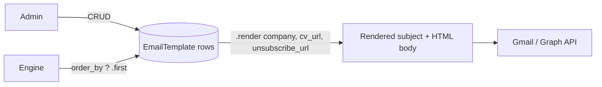

# Email Templates

`EmailTemplate` rows are the variation layer that makes FastJob emails look like personal messages instead of bulk mail. The engine picks one at random for every send; admins create and manage them through the admin panel.

---

## Overview



Three templates are pre-seeded by migration `0002_seed_templates`. You can add more at any time — the engine randomizes across **all active** ones immediately, no restart needed.

---

## Tech specs

### Files

| File | Purpose |
|---|---|
| `apps/mailing/models.py` | `EmailTemplate` model + `render()` |
| `apps/mailing/migrations/0002_seed_templates.py` | Seeds 3 default templates |
| `apps/mailing/admin.py` | Admin registration |

### Model

```python
class EmailTemplate(models.Model):
    name      = models.CharField(max_length=100)          # internal label
    subject   = models.CharField(max_length=300)          # supports {company_name}
    body_html = models.TextField()                         # full HTML body
    is_active = models.BooleanField(default=True)
    created_at = models.DateTimeField(auto_now_add=True)

    def render(self, company_name, cv_url, unsubscribe_url) -> tuple[str, str]:
        ...
```

### Placeholder substitution

`render()` uses Python's built-in `str.format(**context)`. Valid placeholders:

| Placeholder | Replaced with |
|---|---|
| `{company_name}` | `Company.name` |
| `{cv_url}` | `/cv/<uuid>/` — unique per `MailingLog` |
| `{unsubscribe_url}` | `/unsubscribe/<uuid>/` — unique per `MailingLog` |

Both UUIDs are generated fresh for every `MailingLog` row, so each email's links are unique even when the same template is reused.

### Randomization

```python
template = EmailTemplate.objects.filter(is_active=True).order_by("?").first()
```

`order_by("?")` maps to `ORDER BY RANDOM()` in PostgreSQL — a true shuffle at the DB level. With N active templates, each template is used with probability 1/N per send (uniform over time).

**Why randomize:** anti-spam footprint detection flags repeated subject lines across many inboxes. With 3+ variants, no company in the database consistently receives the same subject.

---

## The 3 shipped templates

| Name | Subject | Tone |
|---|---|---|
| Directo — Profesional | `Candidatura para {company_name}` | Formal, direct |
| Breve — Cercano | `¿Tienen vacantes en {company_name}?` | Friendly, brief |
| Motivacional — Entusiasta | `Propuesta de candidatura — {company_name}` | Enthusiastic |

All three embed the CV download button and an unsubscribe footer. The footer is mandatory for CAN-SPAM / GDPR compliance — never remove it.

---

## Admin perspective

### `Django Admin → Mailing → Plantillas de Email`

- **List view:** name, subject preview, `is_active`, `created_at`.
- **Edit view:** full `body_html` textarea (raw HTML). Use any HTML editor externally, then paste in.
- **Deactivating** a template (`is_active = False`) removes it from the engine's random pool immediately. The template isn't deleted so its historical `MailingLog` associations stay intact.
- **Minimum viable pool:** at least 1 active template must exist, or the engine logs a warning and sends nothing that tick.

### Live preview in admin

Every template row has a **"Ver preview"** link in the admin list. It opens `/admin/mailing/emailtemplate/<id>/preview/`, which:
- Renders the template with sample placeholders (`company_name="Empresa Ejemplo S.L."`, dummy `cv_url`/`unsubscribe_url`).
- Shows the fully-rendered subject + HTML body in a recipient-like frame.
- Surfaces any `KeyError` (unknown placeholder) as a big red warning, so you catch typos before activating the template.

### HTML authoring tips

- Keep inline styles — many email clients strip external CSS.
- Always include `{cv_url}` and `{unsubscribe_url}` or the email will not pass the engine's rendering (it would raise a `KeyError`).
- Use the admin preview above as your first-pass sanity check; use a dedicated email tool (Litmus, Email on Acid) for client compatibility.

---

## User perspective

Users never see templates directly. They experience the effect: each company they've emailed received a slightly different subject and body. If a company replies, the reply lands in the user's own inbox as a normal email thread.

---

## Configuration

No env vars. Templates are fully admin-managed database rows.

---

## Edge cases

| Scenario | Behavior |
|---|---|
| Zero active templates | Engine logs `WARNING: No active email templates found.` and skips all sends that tick. |
| Template body contains `{unknown_placeholder}` | `str.format()` raises `KeyError` → `MailingLog.status = FAILED`, error logged. Fix by removing unknown placeholders from the template. |
| Template deleted while referenced by a `MailingLog` | `MailingLog.email_template` becomes `NULL` (FK `on_delete=SET_NULL`). Log row stays readable for audit. |

---

## Testing

- The randomization behavior is implicitly tested in `apps/mailing/tests/test_tasks.py` via the task fixture setup.
- The `render()` method can be unit-tested directly: `EmailTemplate(subject="{company_name}", body_html="{cv_url}").render("Acme", "/cv/x/", "/u/y/")`.

---

## Related docs

- [`mailing-engine.md`](mailing-engine.md) — how templates are selected and rendered per send.
- [`admin-panel.md`](admin-panel.md) — broader admin panel guide.
