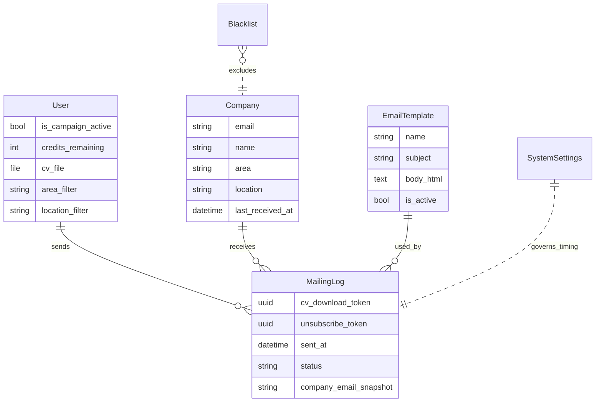
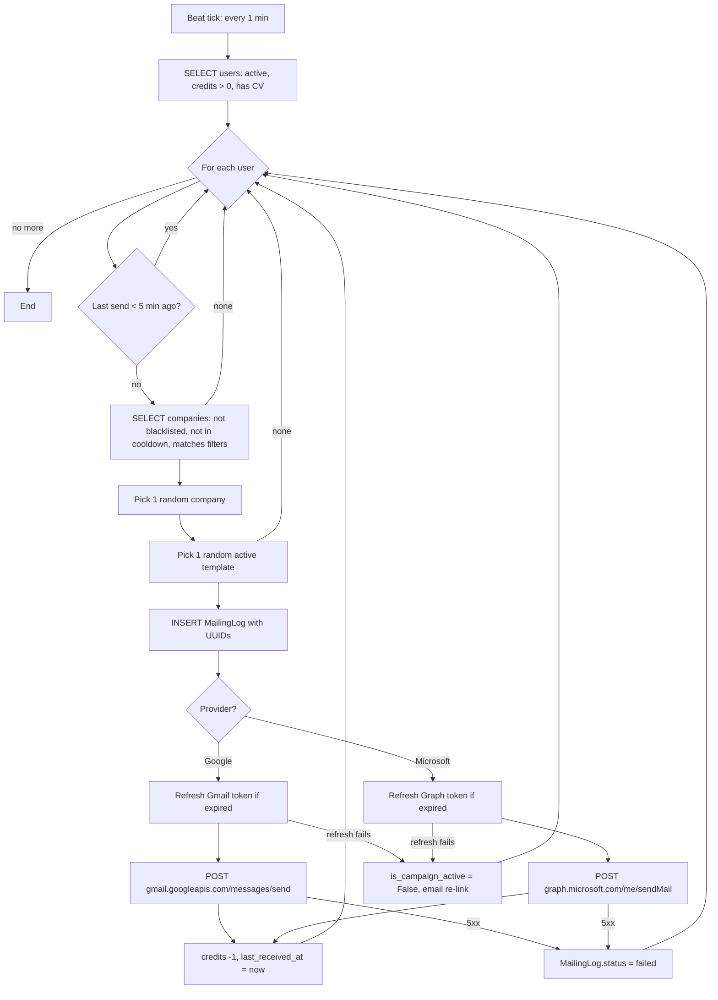

# Mailing Engine

The heart of FastJob. This module decides **who** sends **what** to **whom** at **which time**, using **whose OAuth token**. Every deliverability claim ("slow-drip", "random templates", "no footprint") traces back to code in this feature.

---

## Overview

A Celery periodic task (`process_mailing_queue`) fires once a minute. On each tick, for every active user who has credits, a CV file, and hasn't sent in the last 5 minutes, the task:

1. Picks a random eligible company (not blacklisted, not in 12-hour cooldown, matching the user's area/location filters).
2. Picks a random active `EmailTemplate` (subject + HTML body).
3. Creates a `MailingLog` row with unique UUIDs for the download and unsubscribe links.
4. Refreshes the user's OAuth token if needed.
5. Sends the email via the user's Gmail or Microsoft mailbox.
6. Decrements the user's credit and updates the company's `last_received_at`.

If the OAuth token can't be refreshed, the user's campaign is paused and they get a re-link notification email (see [`notifications.md`](notifications.md)).

---

## Tech specs

### Files

| File | Purpose |
|---|---|
| `apps/mailing/tasks.py` | Celery task `process_mailing_queue` + `send_relink_notification`. |
| `apps/mailing/engine.py` | Sending logic: `send_cv_email`, `_refresh_google_token`, `_refresh_microsoft_token`, Gmail + Graph HTTP calls. |
| `apps/mailing/models.py` | `EmailTemplate`, `MailingLog`, `SystemSettings`. |
| `apps/mailing/management/commands/setup_periodic_tasks.py` | Registers the 1-minute beat entry. |

### Celery scheduling

Periodic task configured through `django-celery-beat` (database-backed scheduler). To register it:

```bash
python manage.py setup_periodic_tasks
```

This creates an `IntervalSchedule(every=1, period=MINUTES)` + a `PeriodicTask` row pointing at `apps.mailing.tasks.process_mailing_queue`.

### Slow-drip parameters

| Parameter | Default | Model field | Admin editable? |
|---|---|---|---|
| Global send interval per user | 5 min | `SystemSettings.global_send_interval_minutes` | Yes |
| Per-company cooldown | 12 h | `SystemSettings.company_cooldown_hours` | Yes |
| Beat tick | 1 min | `django_celery_beat.PeriodicTask` | Yes (Django admin) |

The relationship matters: **beat tick ≤ send interval**. If beat ticks every 5 minutes and send interval is 5 minutes, you'll occasionally skip a cycle due to drift. 1 minute is cheap and keeps timing tight.

### Data model



**Design note — why `company_email_snapshot`:** we snapshot the company's email at send time, so even if the `Company` row is later deleted (GDPR erasure, manual cleanup), the `MailingLog` stays readable for audit purposes. The `ForeignKey` uses `on_delete=SET_NULL`.

---

## Engine flow



---

## The send itself — Gmail vs Microsoft

### Gmail (Google)

We build a MIME message and base64-url-encode it per the Gmail REST API contract:

```python
msg = MIMEMultipart("alternative")
msg["To"] = to_email
msg["From"] = from_email
msg["Subject"] = subject
msg.attach(MIMEText(body_html, "html", "utf-8"))

raw = base64.urlsafe_b64encode(msg.as_bytes()).decode()

requests.post(
    "https://gmail.googleapis.com/gmail/v1/users/me/messages/send",
    headers={"Authorization": f"Bearer {access_token}"},
    json={"raw": raw},
)
```

**Why this matters:** Gmail's send endpoint requires **raw RFC 2822** email, not structured JSON. You can't just send `{"to": ..., "subject": ...}`. The MIME encoding is what makes "From" headers honored.

### Microsoft Graph

Graph accepts structured JSON, which is more forgiving:

```python
requests.post(
    "https://graph.microsoft.com/v1.0/me/sendMail",
    headers={"Authorization": f"Bearer {access_token}"},
    json={
        "message": {
            "subject": subject,
            "body": {"contentType": "HTML", "content": body_html},
            "toRecipients": [{"emailAddress": {"address": to_email}}],
        },
        "saveToSentItems": False,
    },
)
```

**Why `saveToSentItems: False`:** if we let Outlook save sent copies, every user's "Sent" folder fills up with dozens of mechanical-looking emails. Recipients can still forward/reply normally; only the sender's local archive is affected.

---

## OAuth token refresh

Tokens have two lifespans:

| Token | Typical TTL | Purpose |
|---|---|---|
| Access token | ~1 hour | Used for each send |
| Refresh token | indefinite (until revoked) | Used to get new access tokens |

### Google refresh flow

```python
response = requests.post("https://oauth2.googleapis.com/token", data={
    "client_id": GOOGLE_CLIENT_ID,
    "client_secret": GOOGLE_CLIENT_SECRET,
    "refresh_token": token.token_secret,  # allauth stores refresh here
    "grant_type": "refresh_token",
})
```

**Critical config in `settings.py`:**

```python
SOCIALACCOUNT_PROVIDERS = {
    "google": {
        "AUTH_PARAMS": {"access_type": "offline", "prompt": "consent"},
    }
}
```

Without `access_type=offline`, Google **will not issue a refresh token** — you'd only ever have a 1-hour window. The `prompt=consent` forces re-consent on every login, ensuring we get a fresh refresh token even for users who previously authorized without offline access.

### Microsoft refresh flow

```python
response = requests.post(
    "https://login.microsoftonline.com/common/oauth2/v2.0/token",
    data={
        "grant_type": "refresh_token",
        "refresh_token": token.token_secret,
        "scope": "Mail.Send User.Read offline_access",
        # ... client_id, client_secret
    },
)
```

**Critical:** `offline_access` **must** be in both the initial login scope (`settings.SOCIALACCOUNT_PROVIDERS["microsoft"]["SCOPE"]`) and the refresh request. Without it, no refresh token.

---

## Randomization — why it matters

Spam filters at scale use **footprint detection**: if 10 000 emails with the exact same "Candidatura para X" subject arrive at 10 000 different mailboxes, that's a pattern. Even if each email comes from a different sender.

**Our counter:** admins create several `EmailTemplate` rows (shipped with 3 by default — see the seed migration). Each send picks `order_by('?').first()`. Over a day, no two emails from the same FastJob user look identical, and across our entire user base the subject/body distribution is uniform.

**Placeholder substitution** (via `EmailTemplate.render`):
- `{company_name}` → Company.name
- `{cv_url}` → `/cv/<uuid>/` (unique per MailingLog)
- `{unsubscribe_url}` → `/unsubscribe/<uuid>/` (unique per MailingLog)

**Example:** see [`email-templates.md`](email-templates.md) for the 3 shipped variants.

---

## User perspective

The user never directly interacts with the engine. They only see:

- A toggle on the dashboard: **Iniciar campaña / Pausar campaña**.
- Their credit balance decrementing as sends happen.
- An activity feed showing recent sends (with status and recipient).

If the engine decides there's nothing to do (no eligible companies, no active templates, cooldown in effect), the user simply sees no activity — no error, no alert. This is intentional: the engine should never nag.

If the token expires and the campaign auto-pauses, the user gets a transactional email and the toggle flips off.

---

## Admin perspective

### `Django Admin → Mailing → Configuración del Sistema`

Change `global_send_interval_minutes` or `company_cooldown_hours` on the fly. **These apply on the next beat tick** — no deploy, no restart.

### `Django Admin → Mailing → Plantillas de Email`

CRUD of `EmailTemplate`. Mark `is_active` to control which templates the engine randomizes over. Adding a 4th template instantly adds a 4th possible variation to every future send.

### `Django Admin → Mailing → Registros de Envíos`

Read-only audit log of every send. Filter by `status` (sent/failed), search by recipient email. Useful for debugging individual user reports.

---

## Configuration

| Setting | Source | Default | Purpose |
|---|---|---|---|
| Beat tick interval | `django_celery_beat.IntervalSchedule` | 1 min | How often the task fires |
| `global_send_interval_minutes` | `SystemSettings` row | 5 | Per-user slow-drip |
| `company_cooldown_hours` | `SystemSettings` row | 12 | Per-company cooldown |
| `GOOGLE_CLIENT_ID`, `GOOGLE_CLIENT_SECRET` | env | — | OAuth app |
| `MICROSOFT_CLIENT_ID`, `MICROSOFT_CLIENT_SECRET` | env | — | OAuth app |
| `REDIS_URL` | env | `redis://localhost:6379/0` | Celery broker + result backend |
| `SITE_DOMAIN` | env | `localhost:8000` | Used to build `cv_url` and `unsubscribe_url` |

---

## Edge cases and their handling

| Scenario | Outcome |
|---|---|
| User has no credits | Skipped, no log entry. |
| User has credits but no CV | Skipped, no log entry. |
| No active `EmailTemplate` | Task logs a warning, no sends for anyone that tick. Fix: add at least one active template. |
| No eligible companies for a user (all blacklisted / in cooldown / filtered out) | Skipped, no log entry; will retry next tick. |
| Gmail returns 5xx | `MailingLog.status = FAILED` with `error_message`, credit **not** deducted. |
| Gmail returns 200 but email bounces | Out of our visibility today — bounces would appear in the user's Gmail UI. P2 item to handle bounces in [`../../log.md`](../../log.md). |
| Refresh token revoked by user in Google account settings | Refresh fails → campaign pauses → re-link email sent. |
| User deletes CV while campaign is active | `user.cv_file` null check in task → skipped without error. |

---

## Testing

Full coverage in `apps/mailing/tests/`:

- `test_engine.py` — 8 tests covering token refresh (happy/expired/failure), Gmail send, Graph send, no-linked-account, API error propagation. All mock `requests.post`.
- `test_tasks.py` — 9 tests covering slow-drip, blacklist, cooldown, area filter, token-expiry pause, no-credits, no-CV, no-templates.

Run with:
```bash
pytest apps/mailing/tests/
```

See [`monitoring.md`](monitoring.md) for the full test strategy.

---

## Related docs

- [`authentication.md`](authentication.md) — where the OAuth tokens come from.
- [`email-templates.md`](email-templates.md) — how templates are authored and randomized.
- [`cv-management.md`](cv-management.md) — the signed download URLs this engine generates tokens for.
- [`blacklist-unsubscribe.md`](blacklist-unsubscribe.md) — how recipients opt out.
- [`notifications.md`](notifications.md) — the re-link flow when OAuth fails.
