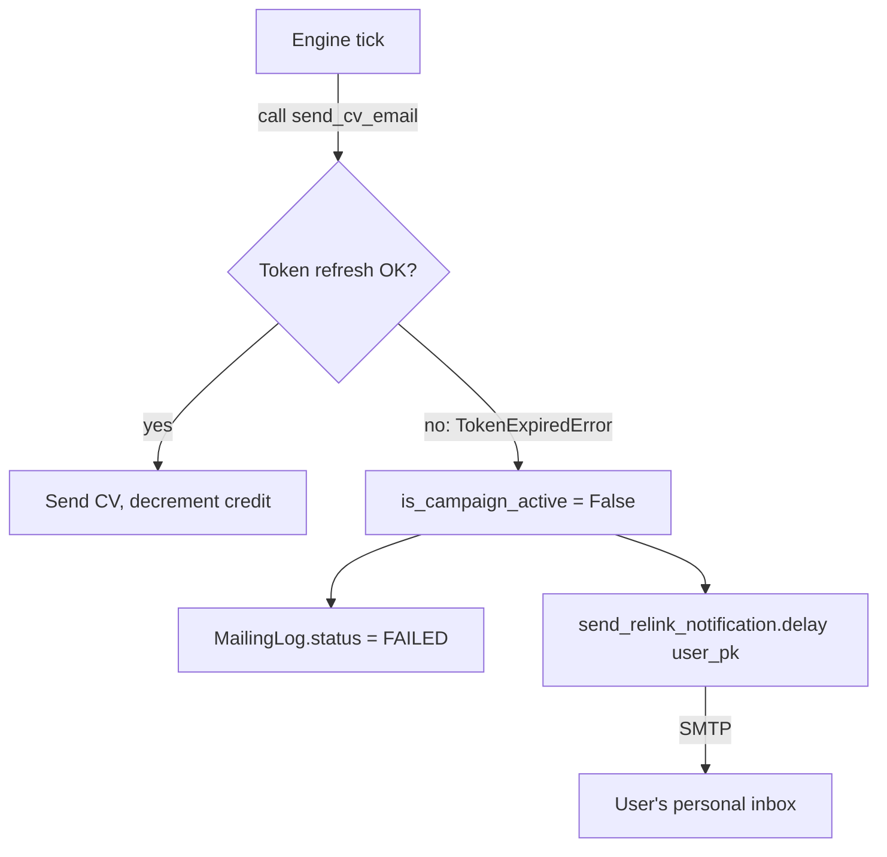

# Re-link Notifications

When a user's OAuth token expires and can't be refreshed, the mailing engine auto-pauses their campaign and sends them a transactional email asking them to re-authorize. This is the only system-initiated email FastJob sends.

---

## Overview



---

## Tech specs

### Files

| File | Purpose |
|---|---|
| `apps/mailing/tasks.py` | `send_relink_notification` Celery task + `TokenExpiredError` handler |
| `apps/mailing/engine.py` | Raises `TokenExpiredError` on refresh failure |

### `send_relink_notification` task

```python
@shared_task
def send_relink_notification(user_pk):
    user = User.objects.get(pk=user_pk)
    relink_url = f"{scheme}://{settings.SITE_DOMAIN}/accounts/login/"
    send_mail(
        subject="FastJob: Vuelve a conectar tu cuenta de correo",
        message=f"... {relink_url} ...",
        from_email=settings.DEFAULT_FROM_EMAIL,
        recipient_list=[user.email],
        fail_silently=True,
    )
```

**Why a Celery task and not inline SMTP:** `send_mail` can block for seconds on a slow SMTP server. Running it inline in the main `process_mailing_queue` task would delay the rest of the user loop. Dispatching as `.delay(user_pk)` makes it non-blocking.

**`fail_silently=True`:** a broken SMTP config should not prevent the campaign-pause logic from completing. The campaign is already paused at this point. If the notification fails, the user just won't receive the email — their campaign is still paused, and they'll notice via the dashboard toggle.

### What triggers `TokenExpiredError`

In `apps/mailing/engine.py`, both `_refresh_google_token` and `_refresh_microsoft_token` raise `TokenExpiredError` when:
1. The HTTP POST to the OAuth token endpoint returns a non-200 status.
2. No `SocialAccount` or `SocialToken` row exists for the user.

A token that's still valid (not yet expired) is never refreshed — the engine checks `token.expires_at` with a 60-second buffer before making the refresh request.

### What happens in `process_mailing_queue` on `TokenExpiredError`

```python
except TokenExpiredError as exc:
    log.status = MailingLog.Status.FAILED
    log.error_message = str(exc)
    log.save(update_fields=["status", "error_message"])
    user.is_campaign_active = False
    user.save(update_fields=["is_campaign_active"])
    send_relink_notification.delay(user.pk)
```

Order matters: the `MailingLog` is written before the notification is dispatched, so if the notification task fails, the audit trail is still there.

---

## The notification email

**Subject:** `FastJob: Vuelve a conectar tu cuenta de correo`

**Body (plain text):**
```
Hola {first_name or email},

Tu sesión de correo ha expirado y tu campaña ha sido pausada.

Por favor, vuelve a iniciar sesión para reanudarla: {relink_url}

El equipo de FastJob
```

The email is plain text only. No HTML, no branding. This is intentional — a branded HTML email from an OAuth-service company can look like phishing to a user who just had their session expire. Plain text reads as a legitimate system alert.

---

## User perspective

1. User receives the email at their signup address (Gmail or Outlook).
2. Clicks the link → taken to `/accounts/login/`.
3. Completes the OAuth consent flow again.
4. New tokens are stored by allauth.
5. They must manually re-enable the campaign (toggle on dashboard).

**Why manual re-enable:** auto-resuming the campaign on re-link could surprise users who paused intentionally. Requiring the user to explicitly restart keeps their intent clear.

---

## Admin perspective

There's no admin UI for re-link notifications. You can see:
- `MailingLog` rows with `status = FAILED` and `error_message` containing `TokenExpiredError` — these correspond to the campaigns that were auto-paused.
- `users` list with `is_campaign_active = False` — some are manually paused, some are auto-paused.

If a user reports they never received the notification email, check:
1. `SMTP` settings in `.env` (host, port, credentials).
2. Whether the notification task errored — check Celery worker logs.
3. The user's spam folder.

---

## Configuration

### SMTP env vars (for system notifications only)

| Variable | Purpose |
|---|---|
| `EMAIL_HOST` | SMTP host (default: `smtp.gmail.com`) |
| `EMAIL_PORT` | SMTP port (default: `587`) |
| `EMAIL_USE_TLS` | TLS flag (default: `True`) |
| `EMAIL_HOST_USER` | SMTP username (e.g. `system@yourdomain.com`) |
| `EMAIL_HOST_PASSWORD` | SMTP password or app password |
| `DEFAULT_FROM_EMAIL` | From header (e.g. `FastJob <system@yourdomain.com>`) |

**This SMTP account is for FastJob's own outgoing mail only** — re-link notifications, future admin alerts, etc. It is completely separate from the user's OAuth-based send flow.

---

## Edge cases

| Scenario | Behavior |
|---|---|
| User's SMTP address is also a campaign recipient | They'll receive the re-link notification through the same inbox. Unlikely to be confusing in practice. |
| `send_relink_notification` Celery task itself fails | `fail_silently=True` in `send_mail` means SMTP errors are swallowed. Campaign is still paused. User won't know unless they check the dashboard. |
| Same user's token expires twice in quick succession (e.g. two rapid ticks) | Both ticks try to pause the campaign and dispatch the task. The second pause is a no-op (already `False`). Two notification emails may be sent. Low probability because the first tick sets `is_campaign_active = False`, so the user is excluded from the second tick's `active_users` query. |

---

## Related docs

- [`authentication.md`](authentication.md) — the OAuth token lifecycle.
- [`mailing-engine.md`](mailing-engine.md) — where `TokenExpiredError` is raised and caught.
