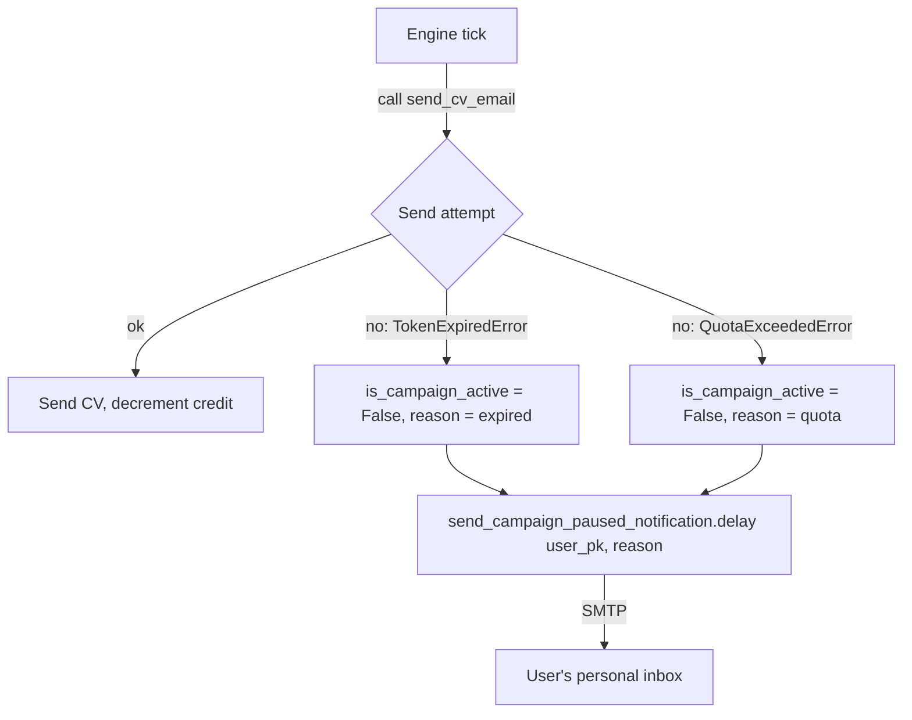

# Campaign Pause Notifications

When a campaign is automatically paused (due to token expiry or provider daily limits), the mailing engine sends a transactional email explaining why.

---

## Overview



---

## Tech specs

### Files

| File | Purpose |
|---|---|
| `apps/mailing/tasks.py` | `send_campaign_paused_notification` Celery task |
| `apps/mailing/engine.py` | Raises `TokenExpiredError` or `QuotaExceededError` |
| `apps/accounts/models.py` | Persists `campaign_pause_reason` on `User` |

### `send_campaign_paused_notification` task

```python
@shared_task
def send_campaign_paused_notification(user_pk, reason):
    user = User.objects.get(pk=user_pk)
    if reason == "quota":
        subject = "FastJob: Límite diario de tu proveedor alcanzado"
        # ... explanation that it resets tomorrow ...
    elif reason == "expired":
        subject = "FastJob: Vuelve a conectar tu cuenta de correo"
        # ... relink instructions ...
    
    send_mail(
        subject=subject,
        message=message,
        from_email=settings.DEFAULT_FROM_EMAIL,
        recipient_list=[user.email],
        fail_silently=True,
    )
```

**Why a Celery task and not inline SMTP:** `send_mail` can block for seconds on a slow SMTP server. Running it inline in the main `process_mailing_queue` task would delay the rest of the user loop. Dispatching as `.delay(user_pk)` makes it non-blocking.

---

## Pause Reasons

### 1. `expired` (Token Expired)
Triggered when the HTTP POST to the OAuth token endpoint returns a terminal error (e.g., `invalid_grant`).
- **UI Banner**: Red, with a "Vincular ahora" button.
- **Email Subject**: `FastJob: Vuelve a conectar tu cuenta de correo`

### 2. `quota` (Provider Daily Limit)
Triggered when the provider returns a rate limit error (e.g., Gmail `rateLimitExceeded` or Microsoft `ErrorExceededMessageLimit`).
- **UI Banner**: Amber, explaining that it resets tomorrow. No action required.
- **Email Subject**: `FastJob: Límite diario de tu proveedor alcanzado`

### 3. `unlinked` (Manual Unlink)
Triggered by the `social_account_removed` signal when a user disconnects their account. No email is sent, but the dashboard displays the reason.
- **UI Banner**: Red, with a "Vincular ahora" button.

---

## User perspective

1. User receives the email at their signup address.
2. They visit their dashboard.
3. If `reason='expired'`, they re-link via the provided button.
4. If `reason='quota'`, they simply wait until tomorrow.
5. In all cases, starting or stopping the campaign manually clears the reason banner.

---

## Admin perspective

There's no admin UI for re-link notifications. You can see:
- `MailingLog` rows with `status = FAILED` and `error_message` containing `TokenExpiredError` — these correspond to the campaigns that were auto-paused.
- `users` list with `is_campaign_active = False` — some are manually paused, some are auto-paused.

If a user reports they never received the notification email, check:
1. `SMTP` settings in `.env` (host, port, credentials).
2. Whether the notification task errored — check Celery worker logs.
3. The user's spam folder.

---

## Configuration

### SMTP env vars (for system notifications only)

| Variable | Purpose |
|---|---|
| `EMAIL_HOST` | SMTP host (default: `smtp.gmail.com`) |
| `EMAIL_PORT` | SMTP port (default: `587`) |
| `EMAIL_USE_TLS` | TLS flag (default: `True`) |
| `EMAIL_HOST_USER` | SMTP username (e.g. `system@yourdomain.com`) |
| `EMAIL_HOST_PASSWORD` | SMTP password or app password |
| `DEFAULT_FROM_EMAIL` | From header (e.g. `FastJob <system@yourdomain.com>`) |

**This SMTP account is for FastJob's own outgoing mail only** — re-link notifications, future admin alerts, etc. It is completely separate from the user's OAuth-based send flow.

---

## Edge cases

| Scenario | Behavior |
|---|---|
| User's SMTP address is also a campaign recipient | They'll receive the re-link notification through the same inbox. Unlikely to be confusing in practice. |
| `send_relink_notification` Celery task itself fails | `fail_silently=True` in `send_mail` means SMTP errors are swallowed. Campaign is still paused. User won't know unless they check the dashboard. |
| Same user's token expires twice in quick succession (e.g. two rapid ticks) | Both ticks try to pause the campaign and dispatch the task. The second pause is a no-op (already `False`). Two notification emails may be sent. Low probability because the first tick sets `is_campaign_active = False`, so the user is excluded from the second tick's `active_users` query. |

---

## Related docs

- [`authentication.md`](authentication.md) — the OAuth token lifecycle.
- [`mailing-engine.md`](mailing-engine.md) — where `TokenExpiredError` is raised and caught.
