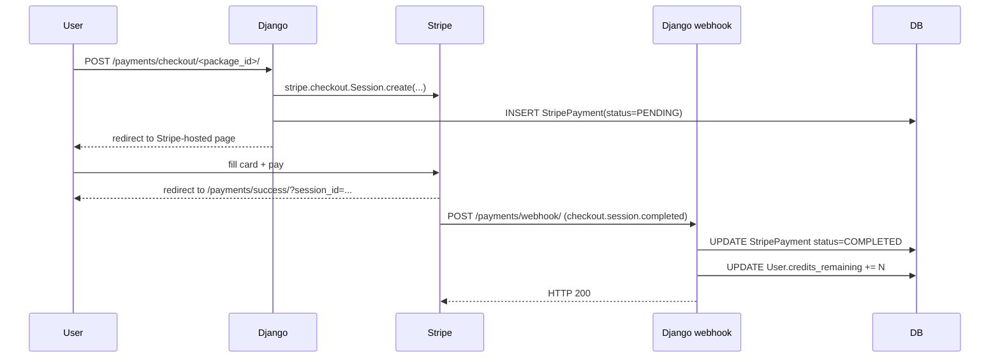

# Payments

ResumeLink sells credits in configurable packages via Stripe Checkout (EUR). The payment flow is stateless on our side — Stripe handles card collection, and we receive a signed webhook to grant credits.

---

## Overview



**Critical:** credits are only granted by the webhook, never by the success page redirect. The redirect can be faked or replayed; the webhook carries Stripe's HMAC signature.

---

## Tech specs

### Files

| File | Purpose |
|---|---|
| `apps/payments/models.py` | `CreditPackage`, `StripePayment` |
| `apps/payments/views.py` | `packages`, `create_checkout`, `payment_success`, `stripe_webhook` |
| `apps/payments/urls.py` | URL patterns |
| `apps/payments/migrations/0002_seed_packages.py` | Seeds 3 default packages |
| `apps/payments/admin.py` | Admin registration |
| `templates/payments/packages.html` | Package selection page |
| `templates/payments/success.html` | Post-payment confirmation |

### Models

**`CreditPackage`**

| Field | Type | Notes |
|---|---|---|
| `name` | `CharField` | Display name (e.g. "Pro") |
| `description` | `TextField` | Sub-copy on the packages page |
| `price_eur` | `DecimalField` | Base price in EUR |
| `credits` | `IntegerField` | Credits granted on purchase |
| `stripe_price_id` | `CharField` | Optional; not used in current dynamic-price flow |
| `is_active` | `BooleanField` | Hides the package from the buy page when `False` |
| `order` | `PositiveIntegerField` | Display order on the packages page |

**`StripePayment`**

| Field | Type | Notes |
|---|---|---|
| `user` | FK → User | `SET_NULL` — record survives user deletion |
| `package` | FK → CreditPackage | `SET_NULL` — record survives package deletion |
| `stripe_session_id` | `CharField(unique=True)` | Stripe's Checkout session ID; idempotency key |
| `stripe_payment_intent` | `CharField` | Filled on webhook completion |
| `amount_eur` | `DecimalField` | Snapshot of price at purchase time |
| `credits_granted` | `IntegerField` | Snapshot of credits at purchase time |
| `status` | `CharField` | `pending` / `completed` / `failed` |
| `created_at` | `DateTimeField(auto_now_add=True)` | |
| `completed_at` | `DateTimeField(null=True)` | Set by webhook handler |

**Why snapshot `amount_eur` and `credits_granted`:** package prices can change. Snapshotting protects both the user (they get what was shown) and us (we have accurate revenue records regardless of future price edits).

### Stripe Customer Portal

Users can view invoices and manage receipts through Stripe's hosted Billing Portal:

- Endpoint: `POST /payments/portal/` (view `billing_portal` in `apps/payments/views.py`).
- Guarded: requires at least one `StripePayment` with `status=COMPLETED`.
- Uses `User.stripe_customer_id` when cached. On first visit (or for legacy users), falls back to `stripe.Customer.list(email=...)` and caches the result for future calls.
- The webhook handler also back-fills `stripe_customer_id` on every `checkout.session.completed` event using `session["customer"]`, so a user who pays once never needs the email fallback again.
- Redirects to a short-lived Stripe-hosted URL (`stripe.billing_portal.Session.create`).
- Entry point: dashboard → credits card → **Facturación** link.

### Checkout creation (`apps/payments/views.py:23`)

The checkout uses **dynamic pricing** (`price_data`) rather than pre-created Stripe Price objects. This means:
- No Stripe dashboard management needed for each package.
- `stripe_price_id` on `CreditPackage` is populated but unused in the current flow.
- Product name in Stripe shows as `"ResumeLink — {package.name}"`.

### Webhook handler

```python
@csrf_exempt
@require_POST
def stripe_webhook(request):
    event = stripe.Webhook.construct_event(
        request.body, sig_header, settings.STRIPE_WEBHOOK_SECRET
    )
    if event["type"] == "checkout.session.completed":
        _handle_successful_payment(event["data"]["object"])
    return HttpResponse(status=200)
```

**CSRF exempt:** Stripe's POST has no Django session cookie. CSRF protection is replaced by HMAC signature verification (`construct_event`).

**Idempotency in `_handle_successful_payment`:**

```python
if not payment or payment.status == StripePayment.Status.COMPLETED:
    return  # already processed, no-op
```

Stripe may replay webhooks on 5xx or timeout. This guard ensures credits are never granted twice for the same session.

---

## Admin perspective

### `Django Admin → Payments → Paquetes de Créditos`

- Create, edit, deactivate packages without a code deploy.
- `is_active = False` hides the package from `/payments/paquetes/` immediately.
- Changing `price_eur` or `credits` only affects future purchases — existing `StripePayment` rows snapshot the original values.
- **Don't delete a package** that has associated `StripePayment` rows — the FK is `SET_NULL` so history survives, but the package name disappears from admin views. Prefer `is_active = False`.

### `Django Admin → Payments → Pagos Stripe`

Read-only audit trail of every purchase. Useful for:
- Verifying a specific user's payment if they claim credits weren't added.
- Cross-referencing `stripe_session_id` with the Stripe dashboard for refund investigations.
- Checking `status = PENDING` for sessions that were created but never completed (user abandoned checkout).

---

## User perspective

### Buying credits

1. Dashboard → "Comprar créditos" or packages page directly.
2. Active packages are listed with name, description, credit count, and price.
3. Clicking "Comprar" submits a form to `POST /payments/checkout/<id>/`.
4. Django creates the Stripe session and redirects to Stripe's hosted checkout page.
5. User fills card details on Stripe's domain (PCI compliance handled by Stripe).
6. Stripe redirects back to `/payments/success/?session_id=...`.
7. Credits appear on the dashboard within seconds (webhook typically fires before the redirect completes).

### If the webhook is delayed

In rare cases, the user reaches the success page before the webhook fires. The success page shows a generic "¡Gracias por tu compra!" regardless — credits will appear shortly when the webhook arrives.

---

## Configuration

### Env vars

| Variable | Purpose |
|---|---|
| `STRIPE_PUBLIC_KEY` | Frontend key (not currently used — checkout is server-side) |
| `STRIPE_SECRET_KEY` | Server-side API calls |
| `STRIPE_WEBHOOK_SECRET` | HMAC verification in `stripe_webhook` |
| `SITE_DOMAIN` | Used to build `success_url` and `cancel_url` |

### Local webhook testing

Stripe cannot reach `localhost`. Use the Stripe CLI to forward events:

```bash
stripe listen --forward-to localhost:8000/payments/webhook/
```

The CLI prints a webhook signing secret — use it as `STRIPE_WEBHOOK_SECRET` in your local `.env`.

---

## Edge cases

| Scenario | Behavior |
|---|---|
| User closes browser mid-checkout | `StripePayment` row stays `PENDING` forever. No credits granted. |
| Stripe webhook fires before success redirect | Credits available by the time the success page loads. |
| Webhook fires twice (Stripe retry) | Second call no-ops: `status == COMPLETED` guard. |
| Package deleted between checkout creation and webhook | `StripePayment.package` → `NULL`. Credits (`credits_granted`) are still granted — they were snapshotted. |
| User's account deleted before webhook | `StripePayment.user` → `NULL`. `_handle_successful_payment` checks `if user:` and skips credit grant. Payment record remains for accounting. |

---

## Related docs

- [`credits.md`](credits.md) — how credits are consumed and the signup bonus.
- [`user-dashboard.md`](user-dashboard.md) — credit balance display.
- [`admin-panel.md`](admin-panel.md) — managing packages.
