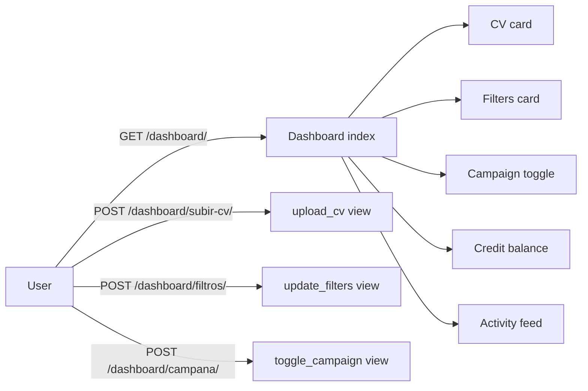

# User Dashboard

The dashboard is the only page a job-seeker needs. It shows their current state and gives them three controls: upload a CV, set filters, and toggle their campaign.

---

## Overview

All dashboard views require login (`@login_required`). Unauthenticated requests redirect to `/accounts/login/`.

---

## Tech specs

### Files

| File | Purpose |
|---|---|
| `apps/dashboard/views.py` | All 4 views |
| `apps/dashboard/urls.py` | URL patterns under `/dashboard/` |
| `templates/dashboard/index.html` | Main dashboard template |

### Views

#### `index` — `GET /dashboard/`

Renders the dashboard with:
- `user` — current user object (active CV, credits, filter fields, campaign status).
- `cvs` — all of this user's `CV` rows (for the multi-CV list UI).
- `recent_logs` + `page_obj` + `paginator` — paginated `MailingLog` rows, 20 per page. Accept `?page=N`.
- `sent_count` — total successful sends ever.
- `sent_today` — successful sends since midnight.
- `sent_this_week` — successful sends in the last 7 days.
- `failed_count` — total failed sends for this user.

#### `upload_cv` — `POST /dashboard/subir-cv/`

1. Validates: file must exist, must end in `.pdf`, must be ≤ 10 MB.
2. Accepts an optional `name` label (e.g. "CV Senior Dev").
3. Creates a **new `CV` row**; never overwrites existing files.
4. Sets `user.active_cv` to the new row.
5. Redirects back to dashboard with a success or error message.

#### `set_active_cv` — `POST /dashboard/cv/<id>/activar/`

Points `user.active_cv` at an existing CV row owned by the current user. 404s if the CV belongs to someone else.

#### `delete_cv` — `POST /dashboard/cv/<id>/eliminar/`

Removes the CV row (and its file from Spaces via the overridden `CV.delete()`). If the deleted CV was active, falls back to the newest remaining CV; if none remain, clears `active_cv` and pauses the campaign.

#### `delete_account` — `GET/POST /dashboard/eliminar-cuenta/`

GDPR-compliant self-service deletion. `GET` shows the confirmation form; `POST` requires the user to type their own email verbatim. On confirmation: all CVs are deleted from Spaces, then `User.delete()` cascades through `MailingLog`, `SocialAccount`, `SocialToken`. `StripePayment` has `on_delete=SET_NULL`, so payment audit trail survives the user deletion for accounting.

#### `update_filters` — `POST /dashboard/filtros/`

Saves `area_filter` and `location_filter` (both stripped strings, can be empty) to the user model. Applies on the **next engine tick** — no restart needed.

#### `toggle_campaign` — `POST /dashboard/campana/`

Accepts `action` = `"start"` or `"stop"`.

**Start guards (all must pass):**

| Guard | Error message |
|---|---|
| `user.has_cv` | "Debes subir tu CV antes de iniciar la campaña." |
| `user.credits_remaining > 0` | "No tienes créditos disponibles. Compra un paquete para continuar." |
| `user.linked_provider` | "Debes vincular tu cuenta de Google o Microsoft." |

**Stop:** always succeeds, no guards.

`has_cv` and `linked_provider` are convenience properties on the `User` model (not stored fields — they're derived from `cv_file` and `socialaccount_set`).

---

## User perspective

### On first visit (no CV, no campaign)

The dashboard shows:
- A "Sube tu CV" prompt with the upload form.
- Campaign toggle disabled (greyed out) until the three guards pass.
- Credit balance showing 5 (signup bonus).
- Empty activity feed.

### Normal use

1. User uploads CV → card shows ✓ and upload date.
2. User optionally sets filters (area: "tecnología", location: "Madrid").
3. User clicks "Iniciar campaña".
4. Every ~5 minutes, a new row appears in the activity feed showing which company received their CV and the send status.
5. Credit balance counts down.

### Activity feed

Each row in `recent_logs` shows:
- Company name and email.
- Template name (internal label).
- `sent_at` timestamp.
- Status (Enviado / Fallido).

Up to 20 rows are shown. There's no pagination (P2 item in `log.md`).

### When to re-link

If the campaign auto-pauses due to an expired OAuth token, the toggle flips to "Pausada" and an email is sent to the user (see [`notifications.md`](notifications.md)). They must log out and back in to re-authorize.

---

## Admin perspective

Admins don't interact with the user dashboard directly. All user-side state is visible and editable in `Django Admin → Usuarios`. See [`admin-panel.md`](admin-panel.md).

---

## Configuration

No env vars specific to the dashboard. Inherits storage config from [`cv-management.md`](cv-management.md).

---

## Edge cases

| Scenario | Behavior |
|---|---|
| User uploads a `.pdf` file with wrong MIME type but correct extension | Accepted (we check extension only). Recipient gets whatever bytes are in the file. |
| User starts campaign with exactly 1 credit | Campaign starts. Engine sends 1 email. Credits hit 0. Engine silently skips the user on subsequent ticks. Toggle stays "active." |
| User's Spaces bucket is unreachable during upload | `S3Boto3Storage.save()` raises an exception. Django 500s. The old CV (if any) is already deleted by the time the new upload fails. **Risk:** user loses their CV. P2 item: delete old CV only after new upload succeeds. |
| Filters are set but no companies match | Engine silently skips the user. User sees no activity. They should broaden their filters or check spelling. |

---

## Related docs

- [`cv-management.md`](cv-management.md) — storage and download mechanics.
- [`credits.md`](credits.md) — credit balance and deduction.
- [`mailing-engine.md`](mailing-engine.md) — what happens after the user starts their campaign.
- [`notifications.md`](notifications.md) — the re-link flow.
